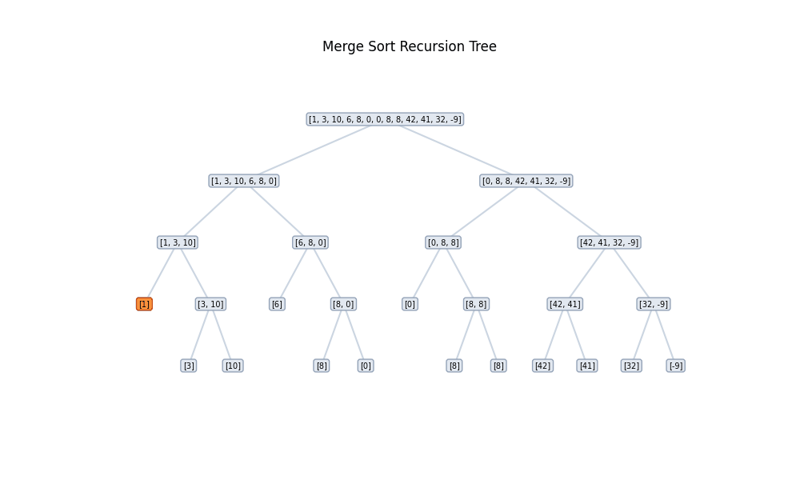

# Merge Sort

A clean Python implementation of Merge Sort, a classic divide-and-conquer sorting algorithm.

## How does Merge Sort work?

Merge Sort is a divide and conquer algorithm that divides the input array into two halves, recursively sorts each half, and then merges the sorted halves back together. The process continues until the entire array is sorted.

The reason I love mergesort is because it perfectly symbolizes how the human mind approaches complex problems: by breaking down something unclear and chaotic into its simplest, ordered parts.



## Usage

```python
from merge_sort import merge_sort

array = [1, 3, 10, 6, 8, 0, 0, 8, 8, 42, 41, 32, -9]
print(merge_sort(array))
# [-9, 0, 0, 1, 3, 6, 8, 8, 8, 10, 32, 41, 42]
```

## Complexity

- **Time:** O(n log n) in all cases
- **Space:** O(n), not in place
- **Stable:** yes, equal elements keep their original relative order

## Run it

```bash
python merge_sort.py
```
